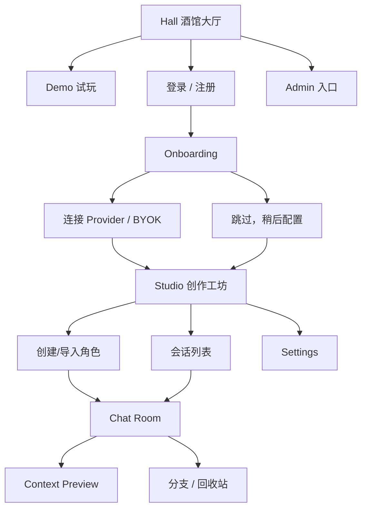

# 03_信息架构与页面地图

## 一级页面

| 页面 | 目标 | 主要用户 |
|---|---|---|
| Hall 酒馆大厅 | 对外展示、Demo、登录引导 | 访客、所有用户 |
| Chat Room 聊天房间 | 长期聊天与上下文控制 | 登录用户 |
| Studio 创作工坊 | 角色、世界书、提示词、记忆管理 | 创作者 |
| Settings 设置中心 | 账号、Provider、数据、外观 | 登录用户 |
| Admin 管理后台 | Demo、日志、健康、审计 | Owner/Admin |

## Hall 酒馆大厅

必须展示：

- 产品一句话说明
- Demo 模式标识
- Demo 角色展示
- “体验 Demo”按钮
- “登录并连接自己的 API”按钮
- 安全说明：访客不会看到站主私人数据，不调用真实 AI
- 移动端友好的首屏

## Chat Room

职责：聊天优先，而不是管理优先。

桌面端结构：

- 左栏：角色/会话列表、搜索、筛选、新建入口
- 中栏：消息流、输入框、消息操作、流式输出
- 右栏：上下文控制台，不是表单堆叠区

右栏显示：

- 当前角色摘要
- 当前场景
- 剧情摘要
- 世界书命中
- 注入记忆
- token/cost 预算
- Provider 状态
- Context Preview 入口

## Studio

用于管理：

- 角色卡
- 世界书
- 记忆
- 提示词模板
- 模型预设
- 导入导出

Studio 是管理区，不要把所有编辑表单都塞进 Chat Room。

## Settings

用于管理：

- 账号信息
- Provider / API Key 策略
- 数据备份与恢复
- 隐私与安全
- 外观
- PWA 安装提示

## Admin

用于管理：

- Demo 内容
- 系统默认模板
- 系统健康
- 成本与限流
- 审计日志
- 错误日志
- 备份状态

## 页面流转图

